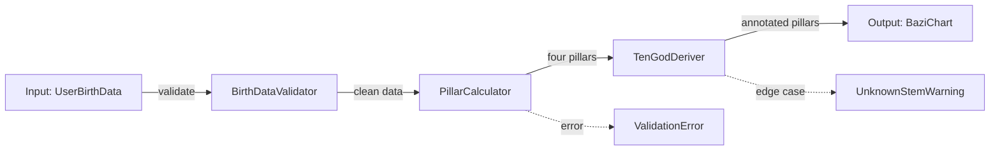

# SKILL: Amateur-Proof Phase Plans

**Trigger:** During SPARC Specification/Pseudocode phases for **Medium+** tasks (≥4 files), or when preparing work for CLI worker delegation via `worker-delegate` skill.

---

## When to Use
- Planning a feature that will be split across multiple phases or sessions.
- Preparing work for delegation to CLI worker agents (Gemini CLI) — see `worker-delegate` skill.
- Creating `/handoff` artifacts for cross-model delegation — see `/handoff` workflow.
- Any **Large/Epic** task per `decision-routing.md` (>10 files, 2+ domains).
- When context pressure is high and work will span multiple sessions.

## When to SKIP
- Trivial/Small tasks (≤3 files, single concern) — fast-path per `execution-protocol.md` §2.
- Bug fixes with clear root cause.
- Documentation-only changes.

---

## The Amateur-Proof Protocol

The goal: **produce phase files so detailed that even a model with zero project knowledge can execute correctly.** This directly improves:
- CLI worker quality (Rule `execution-protocol.md` §8.1)
- Cross-model handoff success rate (`/handoff` → `/receive-handoff`)
- Multi-session persistence (`anti-patterns-core.md` §4 Context Reset Protocol)

### Step 1 — Phase Decomposition

Break the task into self-contained phases. Each phase MUST be independently executable.

```markdown
## Phase Plan — [Feature Name]
**Total Phases:** [N] | **Complexity:** [Medium/Large/Epic per `decision-routing.md`]
**Estimated Tool Budget:** [per `execution-protocol.md` §4]

| Phase | Description | Files | Dependencies | Model |
|---|---|---|---|---|
| P1 | [Types & interfaces] | [list] | None | [per `model-routing.md`] |
| P2 | [Core logic] | [list] | P1 complete | [per `model-routing.md`] |
| P3 | [UI components] | [list] | P2 complete | [per `model-routing.md`] |
| P4 | [Tests & integration] | [list] | P1-P3 complete | [per `model-routing.md`] |
```

**Rules:**
- Each phase touches a **disjoint file set** — no two phases modify the same file (Rule `anti-patterns-swarm.md` §7.1 File Ownership).
- Phase order follows dependency graph — later phases only depend on earlier phases.
- Each phase has a clear **entry condition** (what must be true before starting) and **exit condition** (what must be true when done).

### Step 2 — Data Flow Diagram

For each phase, generate a Mermaid data flow diagram showing inputs → transformations → outputs.

````markdown
## Data Flow — Phase [N]: [Name]



**Key decisions:**
- [Why this data flows this way, not another way]
- [Trade-off considered and rejected]
````

### Step 3 — Code Contracts

For every function/module that crosses phase boundaries, define explicit input/output type signatures. This is the "handshake" between phases.

```markdown
## Code Contracts — Phase [N] → Phase [N+1]

### Contract 1: [Module/Function Name]
**File:** `src/engine/[file].ts`
**Exported by:** Phase [N]
**Consumed by:** Phase [N+1]

```typescript
// Input type
interface PillarInput {
 year: number; // Gregorian year
 month: number; // 1-12
 day: number; // 1-31
 hour: number; // 0-23
 minute: number; // 0-59
 timezone: number; // UTC offset in hours
}

// Output type
interface PillarOutput {
 yearPillar: StemBranch;
 monthPillar: StemBranch;
 dayPillar: StemBranch;
 hourPillar: StemBranch;
 solarTermMonth: number; // Adjusted month based on solar terms
}

// Function signature
export function calculatePillars(input: PillarInput): PillarOutput;
```

**Invariants:**
- `solarTermMonth` may differ from `month` near solar term boundaries
- All `StemBranch` values are non-null (throw if calculation fails)
- Hour pillar uses true solar time correction per `instructions.md`
```

### Step 4 — Failure Scenarios

For each phase, enumerate what can go wrong and how to recover. This prevents the executing model from getting stuck.

```markdown
## Failure Scenarios — Phase [N]: [Name]

| # | Scenario | Signal | Recovery |
|---|---|---|---|
| F1 | [Import path doesn't exist] | `Module not found` error | Create the missing type file in P1 first |
| F2 | [Solar term boundary edge case] | `solarTermMonth` returns undefined | Use fallback: `month` as-is, log warning |
| F3 | [Circular dependency] | TypeScript type error in build | Extract shared types to `types/shared.ts` |
| F4 | [Test data mismatch] | Test fails on known-good date | Verify test data against academic source before debugging |

### Escalation Path
If failure is NOT in the table above → check `anti-patterns-core.md` §5 Multi-Level Circuit Breaker:
1. Step-level: try alternative tool/approach (3 attempts)
2. Task-level: progress audit (5 consecutive no-progress calls)
3. Agent-level: escalate to @pm with findings
```

### Step 5 — Phase File Generation

Write each phase as a self-contained file:

```markdown
# Phase [N]: [Name] — [Feature]
**Status:** [ ] Not Started / [/] In Progress / [x] Complete
**Entry Condition:** [what must be true before starting this phase]
**Exit Condition:** [what must be true when this phase is done]
**Estimated Tool Budget:** [N calls per `execution-protocol.md` §4]

## Architecture Context
- **Project type**: [from `instructions.md`]
- **Styling**: [...]
- **Conventions**: [...]

## Data Flow
[Mermaid diagram from Step 2]

## Code Contracts
[Contracts from Step 3]

## Files to Create/Modify
| File | Action | Description |
|---|---|---|
| `src/[path]` | CREATE | [what] |
| `src/[path]` | MODIFY | [what changes] |

## Files to Read (Context Only)
| File | Why |
|---|---|
| `src/[path]` | [reference pattern] |

## Off-Limits Files
| File | Reason |
|---|---|
| `src/[path]` | [owned by another phase/agent] |

## Failure Scenarios
[Table from Step 4]

## Verification
```bash
npx tsc --noEmit
npm run lint
npm test -- --grep "[relevant tests]"
```

## Completion Checklist
- [ ] All contracts satisfied (types match signatures)
- [ ] No TypeScript errors
- [ ] Lint passes
- [ ] Tests pass (if applicable)
- [ ] Exit condition verified
```

---

## File Management

Phase files are stored based on use case:

| Use Case | Location | Read By |
|---|---|---|
| Multi-session self-persistence | `.hc/phases/[feature]/phase-[N].md` | Same agent in next session |
| CLI worker delegation | `.agent/spawn_agent_tasks/[task-name]-phase-[N].md` | CLI worker via `worker-delegate` |
| Cross-model handoff | `.hc/handoffs/[date]-[task]-phase-[N].md` | Target model via `/receive-handoff` |

---

## Plan Review Loop

After completing each phase file (Step 5), validate it before moving on:

1. Spawn a **review** worker using `plan-reviewer-prompt.md` template (read-only, `--yolo`)
2. Provide: phase file content + original spec/requirements
3. If `ISSUES_FOUND` → fix the issues in the phase file → re-review
4. If `APPROVED` → proceed to next phase (or execution handoff if last phase)

**Loop limits:** Max **3 review iterations** per phase. If still failing → surface to user for guidance.

> [!TIP]
> The review loop is cheap (read-only workers) and catches common issues: missing verification steps, ambiguous instructions, incomplete contracts. Worth the extra 1-2 minutes per phase.

---

## Integration Points

This skill connects to the following framework components:

| Component | Type | Integration |
|---|---|---|
| [`decision-routing.md`](.agent/rules/decision-routing.md) | Rule | Determines when this skill activates (Medium+ tasks) |
| [`model-routing.md`](.agent/rules/model-routing.md) | Rule | Selects per-phase model (cheaper models for simple phases) |
| [`execution-protocol.md`](.agent/rules/execution-protocol.md) | Rule | SPARC Specification phase is where plans are generated |
| [`decision-routing.md`](.agent/rules/decision-routing.md) | Rule | Each phase gets a confidence score at completion |
| [`anti-patterns-core.md`](.agent/rules/anti-patterns-core.md) | Rule | §4 Context Reset → save phase state; §7 File Ownership → phase file disjointness |
| [`execution-protocol.md`](.agent/rules/execution-protocol.md) | Rule | §5 Tool budgets per phase; §6 CLI worker spawn limits |
| [`worker-delegate.md`](.agent/skills/worker-delegate.md) | Skill | Phase files become worker prompts — all mandatory sections satisfied |
| [`critical-thinking-models.md`](.agent/skills/critical-thinking-models.md) | Skill | Run before phase decomposition for Medium+ features |
| [`structured-analysis-frameworks.md`](.agent/skills/structured-analysis-frameworks.md) | Skill | MECE decomposition for phase breakdown |
| [`/handoff`](.agent/workflows/handoff.md) | Workflow | Phase files ARE the handoff payload for cross-model delegation |
| [`/receive-handoff`](.agent/workflows/receive-handoff.md) | Workflow | Receiving agent reads phase files as execution instructions |
| [`/hc-sdlc`](.agent/workflows/hc-sdlc.md) | Workflow | Phase plans generated during SPARC S→P phases |
| [`/delegate-task`](.agent/workflows/delegate-task.md) | Workflow | Phase files used as CLI worker prompts |

---

## Rules
- **Code contracts are binding.** If Phase N+1 finds the contract doesn't match reality, it must fix Phase N's output, NOT silently adapt.
- **Phases must be independently verifiable.** Each phase has its own verification commands (Rule `execution-protocol.md` §3).
- **Failure tables are non-optional.** Every phase MUST list at least 3 failure scenarios. If you can't think of failures, you haven't understood the problem.
- **Confidence scores per phase.** Apply `decision-routing.md` at phase completion — if score < 60, halt before starting next phase.
- **Don't over-phase.** 3-5 phases for Large tasks, 5-8 for Epic. More than 8 phases = you're probably over-engineering the plan.

## Anti-Patterns
- **Phase Explosion:** Breaking into 15 micro-phases — overhead exceeds benefit. Consolidate.
- **Coupled Phases:** Two phases that both need to modify the same file — violates file ownership. Restructure.
- **Contract Drift:** Phase N's output diverges from its contract — downstream phases fail silently. Always verify contracts at phase boundary.
- **Optimism Bias:** Listing zero failure scenarios — see `critical-thinking-models.md` §3 (Inversion/Pre-Mortem).
