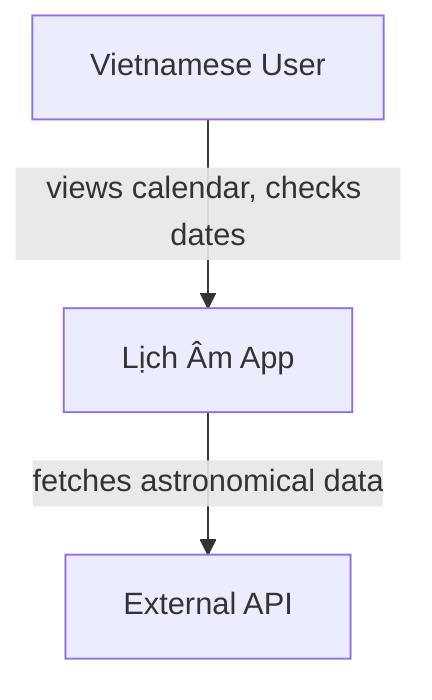
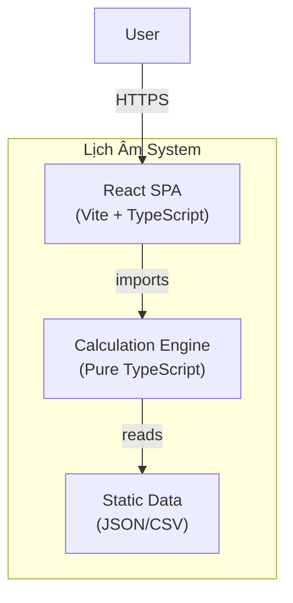
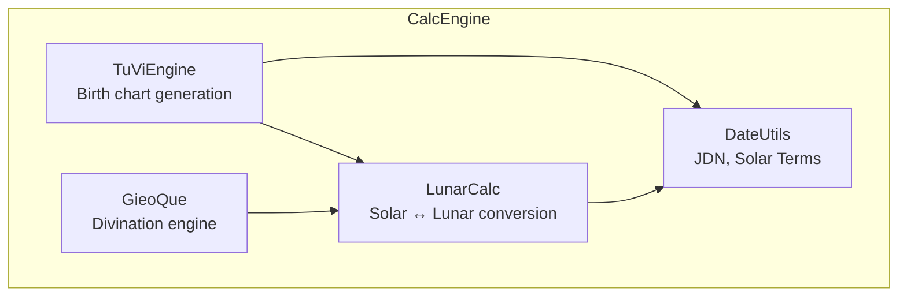

# SKILL: C4 ARCHITECTURE

**Trigger:** When @sa designs or documents system architecture, creates architecture diagrams, or explains system structure.

---

## When to Use
- Starting a new project or feature that needs architecture documentation.
- Creating or updating `docs/tech/ARCHITECTURE.md`.
- Communicating system design to stakeholders at different levels of detail.
- Running the system design workflow.

---

## The C4 Model

Think about architecture in **4 zoom levels**, from broadest to most detailed:

### Level 1: Context Diagram
**Audience:** Everyone (stakeholders, users, devs)
**Question:** "What does the system do and who uses it?"

Shows the system as a single box, surrounded by its users and external systems.

**Template:**
- One box for YOUR system
- Boxes for every **user type** (personas from PRD)
- Boxes for every **external system** your app talks to
- Arrows showing **what data flows** between them

### Level 2: Container Diagram
**Audience:** Technical team
**Question:** "What are the major building blocks?"

Shows the high-level technical pieces: web app, mobile app, API server, database, etc.

**For each container, document:**
- Technology choice (React, Node, PostgreSQL, etc.)
- Responsibility (what it owns)
- Communication protocol (HTTP, import, message queue)

### Level 3: Component Diagram
**Audience:** Developers
**Question:** "What are the major components inside each container?"

Shows the internal structure of a single container.

**For each component, document:**
- Name and responsibility
- Key interfaces / public methods
- Dependencies on other components

### Level 4: Code Diagram
**Audience:** Individual developer working on that code
**Question:** "How is this component implemented?"

Usually NOT drawn as a diagram — the code IS the Level 4 documentation. Use this level only for:
- Complex algorithms that need visual explanation
- State machines
- Data transformation pipelines

---

## When to Use Which Level

| Situation | Level |
|-----------|-------|
| Explaining to stakeholders / investors | Level 1 (Context) |
| Onboarding a new developer | Level 2 (Container) |
| Planning a new feature | Level 3 (Component) |
| Debugging complex logic | Level 4 (Code) |
| `docs/tech/ARCHITECTURE.md` | Levels 1 + 2 + 3 |

---

## Quality Checklist
- [ ] Level 1 shows ALL external actors and systems
- [ ] Level 2 shows technology choices for each container
- [ ] Level 3 shows component responsibilities and dependencies
- [ ] Arrows are labeled with what data/protocol flows
- [ ] Diagrams use Mermaid.js syntax for easy maintenance
- [ ] Each level answers its core question clearly
