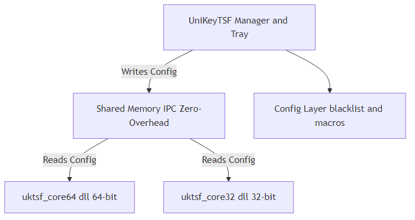

# UniKey TSF Reborn

**UniKey TSF Reborn** is a modern Vietnamese keyboard (Input Method Editor) for Windows that currently uses a **hybrid architecture**: a manager EXE, a shared-memory config layer, a hook-based primary typing path, and a TSF text service that is present but not yet the sole routing authority.

The long-term direction is to modernize the project toward **TSF-primary** behavior with explicit routing and bounded fallback, but that is not the current runtime truth today.

---

## 🚀 Current Project State

- **Hybrid runtime today:** `UniKeyTSF.exe` still installs global hooks and owns startup, tray, settings, and shared config.
- **TSF service present:** the repo includes a substantial TSF COM text service and registration flow, but TSF is not yet documented as the sole active input path.
- **Classic Vietnamese typing support:** the engine and tests cover Telex, VNI, VIQR, charset conversion, macros, and related composition behavior.
- **Windows-native implementation:** C++17, Win32, COM, shared memory IPC, and GoogleTest-based regression binaries.

## 🏗️ Architecture & Components

The application uses a shared memory IPC model (`Local\UniKeyTSF_SharedConfig`) to communicate configuration between the manager process and TSF components.

Current runtime shape:

- **Manager EXE:** bootstraps registration, creates the hidden window, owns tray/settings UI, and installs hooks.
- **Hook path:** the effective primary typing path in current builds.
- **TSF path:** implemented and registered, but not yet the only authoritative path.
- **Shared config:** `UniKeyConfig` in `src/shared_config.h`, persisted under `%APPDATA%\UniKeyTSF\config.dat`.



### Tech Stack
- **Language:** C++17 (MSVC)
- **UI:** Pure Win32 API (`windows.h`, `.rc` resource files)
- **IPC:** `CreateFileMappingW` / `MapViewOfFile`
- **COM Lifecycle:** Windows Runtime Library (`wrl/client.h`)
- **Build System:** CMake 3.20+ targeting Visual Studio 2022
- **Testing:** GoogleTest

## 🛠️ Build & Deployment

### Prerequisites
- Windows 10/11 (x64)
- Visual Studio 2022 with **C++ Desktop workload**
- CMake 3.20+

### Building from Source

The build system automatically generates both x86 and x64 targets to ensure full compatibility across 32-bit and 64-bit applications.

```powershell
# 1. Configure the project for Visual Studio 2022
cmake -B build -G "Visual Studio 17 2022" -A x64

# 2. Build the Release configuration
cmake --build build --config Release
```

*Alternatively, you can run the provided `build_all.bat` script to compile both architectures automatically.*

### Deployment
1. Copy the resulting `UniKeyTSF.exe` to a permanent location (e.g., `C:\Program Files\UniKeyTSF\`).
2. Run `UniKeyTSF.exe /register` once as the normal user that will use the IME.
3. Run `UniKeyTSF.exe /tsf-diagnostics` from a shell to check activation status (`key=value` output: `status`, `dll_registered`, `profile_present`, `profile_active`, `dll_hr`, `profile_hr`, `next_step`).
4. If diagnostics reports `profile_missing`, rerun `UniKeyTSF.exe /register`, then reopen Windows input settings so the profile list refreshes.
5. If diagnostics reports `profile_inactive`, enable **UniKey TSF Reborn** in Windows input settings for Vietnamese.
6. Run `UniKeyTSF.exe` normally to start tray/settings/hook runtime.
7. To uninstall, exit the application from the tray menu, run `UniKeyTSF.exe /unregister`, and delete the folder.

## 📚 Documentation

Detailed documentation is available in the `docs/` folder:

- **Business / Product**
  - [Product Requirements Document (PRD)](./docs/biz/PRD.md)
  - [Product Brief](./docs/biz/PRODUCT_BRIEF.md)
- **Engineering**
  - [Architecture Overview](./docs/tech/ARCHITECTURE.md)
  - [API Contracts / IPC](./docs/tech/API_CONTRACTS.md)
  - [Deployment Guide](./docs/tech/DEPLOYMENT.md)
  - [Test Plan](./docs/tech/TEST_PLAN.md)

## 🧪 Blocking Validation Matrix

The active modernization plan uses this app matrix as the default blocking validation set:

- Notepad
- Edge textarea
- VS Code editor
- Windows Terminal
- elevated Notepad
- WordPad or another RichEdit-style editor

The project should not claim TSF-primary readiness until behavior is verified against that matrix.

## ⚖️ License

This project is licensed under the **GPL-3.0 License**, ensuring it remains free and open-source software (FOSS).
